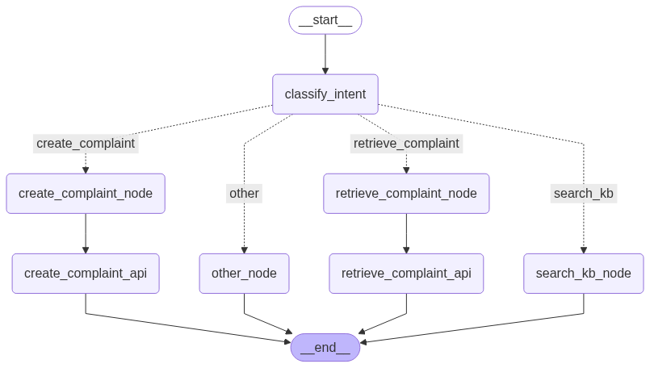

# Agentic RAG-based Chatbot with Complaint Creation API

## Project Overview

Develop a Retrieval-Augmented Generation (RAG) based chatbot that handles customer
complaints by creating complaint records via API calls, collecting follow-up details (name,
phone number, email, complaint details), generating a unique complaint ID, and retrieving
complaint details when queried with the complaint ID.
- 🗣️ Natural language complaint registration
- 🔗 API-based complaint record creation and retrieval
- 🧠 Context-aware follow-up questioning
- 📚 Knowledge Base (KB) retrieval using RAG

## Architecture


## Demo Video
https://drive.google.com/file/d/1w7cxOh2rOObFLYW458nMn6kcTFZYKGIK/view?usp=sharing


## Features

### RAG Chatbot
- Uses Langgraph for Agentic system and LangChain + Google Gemini for contextual conversations
- Answers user queries from a local **knowledge base** of **Comprehensive Customer Support and Service Policy for electronics**

- Collects complaint details in a multi-turn dialogue (name, email, phone, complaint)
- Supports both complaint **creation** and **retrieval**

### RESTful Complaint API
- **POST /complaints** – create complaint
- **GET /complaints/{complaint_id}** – retrieve complaint

## Technology Stack

- **API Service Stack**: FastAPI, PostgreSQL, Alembic(DB Migration), Pydantic.
- **Agentic Chatbot Stack**: Langgraph, Langchain, Google Gemini. 
- **Frontend**: Gradio


## Installation

1. Clone the repository: ```git clone <repository_url>```
2. Navigate to the project directory: ```cd complaint_creation_chatbot```
3. Create a virtual environment: ```python -m venv venv```
4. Install dependencies: ```pip install -r requirements.txt```
4. Set up environment variables: ```cp .env.example .env```


## Usage
1. Start the API server: ```python .\src\api_service\main.py ```
2. Start the frontend: ```python .\src\chatbot\frontend.py```

## Contact

- **Name**: Amber Goswami
- **Email**: ambergoswami9@gmail.com
